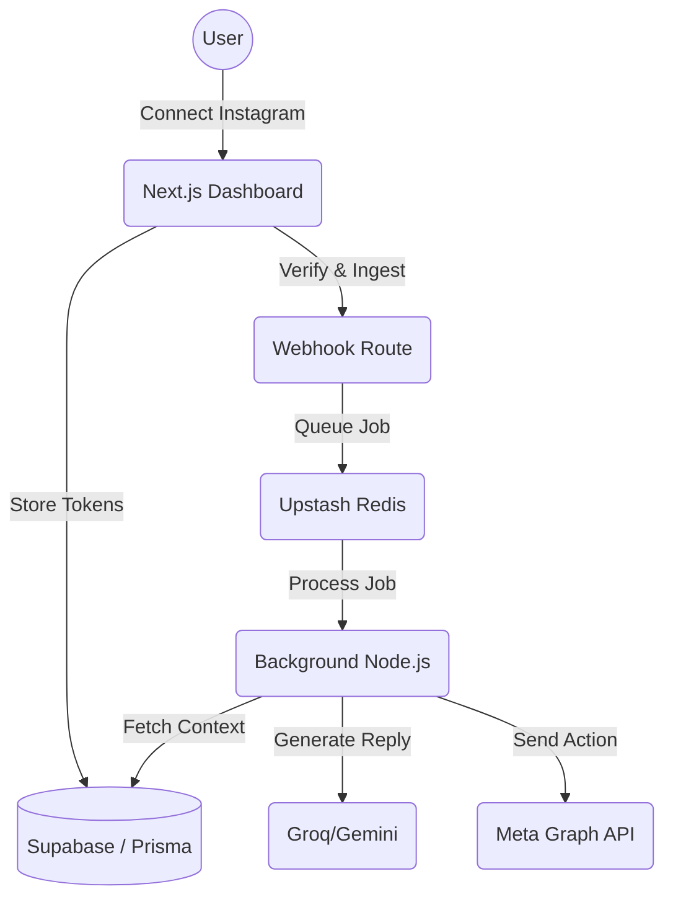

# 🚀 Ventry

### AI-Powered Social Automation Engine

A high-performance event-driven SaaS monorepo for automating social media interactions, analyzing intents, and generating intelligent replies via dual-pipeline AI integration.

[](./walkthrough.md)
[](./packages/automation/)


---

## ✨ Features

### ⚙️ Core Engine
| Feature | Status | Description |
|---|---|---|
| **Event-Driven Ingestion** | ✅ LIVE | Idempotent webhook parsing seamlessly enqueued to BullMQ. |
| **Automation Matcher** | ✅ LIVE | Modular system identifying keywords and mapping them to AI actions. |
| **Contextual Awareness** | ✅ LIVE | Thread-aware context building (last 10 messages) for natural AI replies. |
| **Abuse Protection** | ✅ LIVE | Ignore-self logic, 5s loop breakers, and 10-reply/10-min rate limits. |

### 🤖 Meta Integration
| Feature | Status | Description |
|---|---|---|
| **Meta OAuth** | ✅ LIVE | Secure OIDC/OAuth redirect and callback flow for Page access. |
| **Long-Lived Tokens** | ✅ LIVE | Automatic upgrade to **60-day Page Access Tokens** for stability. |
| **Account Discovery** | ✅ LIVE | Automatic identification of IG Business Accounts across all user Pages. |
| **Resilient Retries** | ✅ LIVE | 3-retry exponential backoff (1s, 5s, 15s) for Meta API 5xx/429 errors. |

### 🛡️ Security & Hardening
| Feature | Status | Description |
|---|---|---|
| **Full RLS (Supabase)** | ✅ LIVE | Row Level Security enabled on all core tables (`User`, `Account`, `Automation`, etc). |
| **Owner-Only Policies** | ✅ LIVE | Strict multi-stage subquery policies enforcing `auth.uid()` ownership. |
| **Governed AI** | ✅ LIVE | Constrained system instructions for brand voice, length, and anti-hallucination. |

---

## 🏗 Architecture



---

## 🛠 Tech Stack

| Layer | Technology | Purpose |
|---|---|---|
| **Backend** | Node.js, BullMQ, Upstash | High-concurrency worker layer with persistent queues |
| **Database** | Supabase Postgres, Prisma | Relational scale with RLS security policies |
| **AI (Fast)** | Groq / Llama 3.3 Versatile | Blazing fast conversational text auto-replies |
| **AI (Reasoning)**| Gemini 1.5 Flash | High-fidelity post and caption creation |
| **Frontend** | Next.js 14, TailwindCSS | Modern reactive dashboard and platform UI |
| **Tooling** | PNPM + Turborepo | Strict monorepo package boundaries and caching |

---

## 🚀 Getting Started

### 1. Prerequisites
- Node.js 18+
- PNPM (`npm install -g pnpm`)
- Meta App (Instagram Messenger permissions)

### 2. Environment Configuration
Populate the root `.env` file with your credentials for Supabase, Meta, Groq, and Gemini.

### 3. Initialize & Run
```bash
# 1. Install dependencies
pnpm install

# 2. Setup your database
npx prisma db push --schema=packages/db/prisma/schema.prisma

# 3. Launch the full platform (Web + Worker)
npx pnpm dev
```

The Dashboard is available at `http://localhost:3000`.

---

## 📋 Ongoing Status (Roadmap)
- [x] Phase 1: Architecture & Infrastructure
- [x] Phase 2: Automation Engine logic
- [x] Phase 3: Meta Integration & OAuth
- [x] Phase 4: Hardening & Reliability (Full RLS)
- [ ] **Phase 5: Payments & Subscriptions (Stripe Checkout Integration)**
- [ ] **Phase 6: Advanced Multi-Channel Triggers (Comment-to-DM)**

---

## 📝 License
This project is licensed under the **MIT License**.
