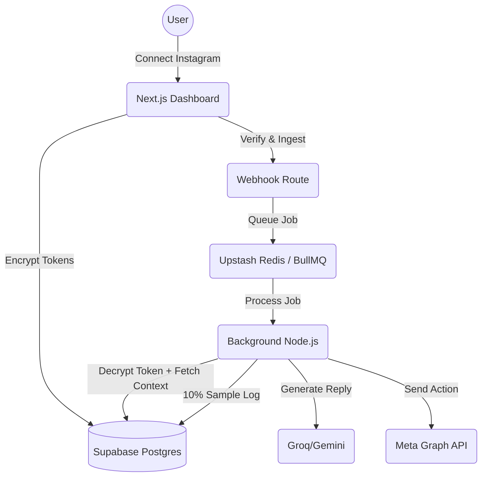

# 🚀 Ventry

### AI-Powered Social Automation Engine

A high-performance event-driven SaaS monorepo for automating social media interactions, analyzing intents, and generating intelligent replies via dual-pipeline AI integration. Built for massive scale and resilience.

[](./walkthrough.md)
[](./packages/automation/)


---

## ✨ Features

### ⚙️ Core Engine
| Feature | Status | Description |
|---|---|---|
| **Event-Driven Ingestion** | ✅ LIVE | Idempotent webhook parsing seamlessly enqueued to BullMQ. |
| **Automation Matcher** | ✅ LIVE | Modular system identifying keywords and mapping them to AI actions. |
| **Contextual Awareness** | ✅ LIVE | Thread-aware context building (last 10 messages) for natural AI replies. |
| **Abuse Protection** | ✅ LIVE | Ignore-self logic, 5s loop breakers, and 10-reply/10-min rate limits. |

### 🤖 Meta Integration & Resilience
| Feature | Status | Description |
|---|---|---|
| **Meta OAuth** | ✅ LIVE | Secure OIDC/OAuth redirect and callback flow for Page access. |
| **Token Resilience** | ✅ LIVE | Strict terminal error invalidation (Code 190) & deduplicated UI alerts. |
| **Smart Retries** | ✅ LIVE | Exponential backoff for API 5xx errors & explicit retry throws for Rate Limits (Codes 4/17). |

### 🛡️ Security & Hardening
| Feature | Status | Description |
|---|---|---|
| **Token Encryption** | ✅ LIVE | AES-256-GCM encryption at rest on all Meta long-lived access tokens. |
| **Full RLS (Supabase)** | ✅ LIVE | Row Level Security enabled on all core tables. |
| **Worker Observability**| ✅ LIVE | Database-backed logging with 10% sampling, attempt tracking, and crash-guard wrappers. |
| **System Health** | ✅ LIVE | Real-time O(1) Dashboard monitoring of queue depths and active alerts. |

---

## 🏗 Architecture



---

## 🛠 Tech Stack

| Layer | Technology | Purpose |
|---|---|---|
| **Backend** | Node.js, BullMQ, Upstash | High-concurrency worker layer with persistent queues |
| **Database** | Supabase Postgres, Prisma | Relational scale with custom AES-GCM token encryption |
| **AI (Fast)** | Groq / Llama 3.3 Versatile | Blazing fast conversational text auto-replies |
| **AI (Reasoning)**| Gemini 1.5 Flash | High-fidelity post and caption creation |
| **Frontend** | Next.js 14, TailwindCSS | Modern reactive dashboard and platform UI |
| **Tooling** | PNPM + Turborepo | Strict monorepo package boundaries and caching |

---

## 🚀 Getting Started

### 1. Prerequisites
- Node.js 18+
- PNPM (`npm install -g pnpm`)
- Meta App (Instagram Messenger permissions)
- Upstash Redis instance (TCP URL required)

### 2. Environment Configuration
Populate the root `.env` file with your credentials:
- `DATABASE_URL` (Supabase Postgres URI)
- `REDIS_URL` (Upstash TCP endpoint)
- `ENCRYPTION_KEY` (32-byte secret for AES-256-GCM)
- `INSTAGRAM_APP_ID` & `INSTAGRAM_APP_SECRET`

### 3. Initialize & Run
```bash
# 1. Install dependencies
pnpm install

# 2. Setup your database
npx prisma db push --schema=packages/db/prisma/schema.prisma

# 3. Launch the full platform (Web + Background Processors)
npx pnpm dev
```

The Dashboard is available at `http://localhost:3000`.

---

## 📋 Ongoing Status (Roadmap)

### Completed
- [x] **Architecture & Infrastucture**: Turborepo, Next.js 14 App Router, Supabase Postgres.
- [x] **Automation Engine**: BullMQ workers, Idempotency, Thread-aware contexts.
- [x] **Token Resilience**: AES-256-GCM Encryption, Rate-Limit catching, and Deduplicated Alerts.
- [x] **Scale Observability**: 10% sampled Worker logging, O(1) System Health UI logic.
- [x] **UI Polish**: Framer-Motion style CSS animations, tactile button states, loading spinners.

### Pending / To-Do
- [ ] **Front-End Automation Builder**: UI allowing users to visually construct Triggers and Actions.
- [ ] **Post Publishing Implementaton**: Hooking up the actual Meta Graph API calls inside the `postQueue` worker.
- [ ] **Subscriptions & Payments**: Integrating Stripe Checkout for the `premium` and `pro` tiers based on user limits.
- [ ] **Advanced AI Contexting**: Refining the AI prompts in `@ventry/ai` to utilize deeper vector search or brand voice profiles.

---

## 📝 License
This project is licensed under the **MIT License**.
