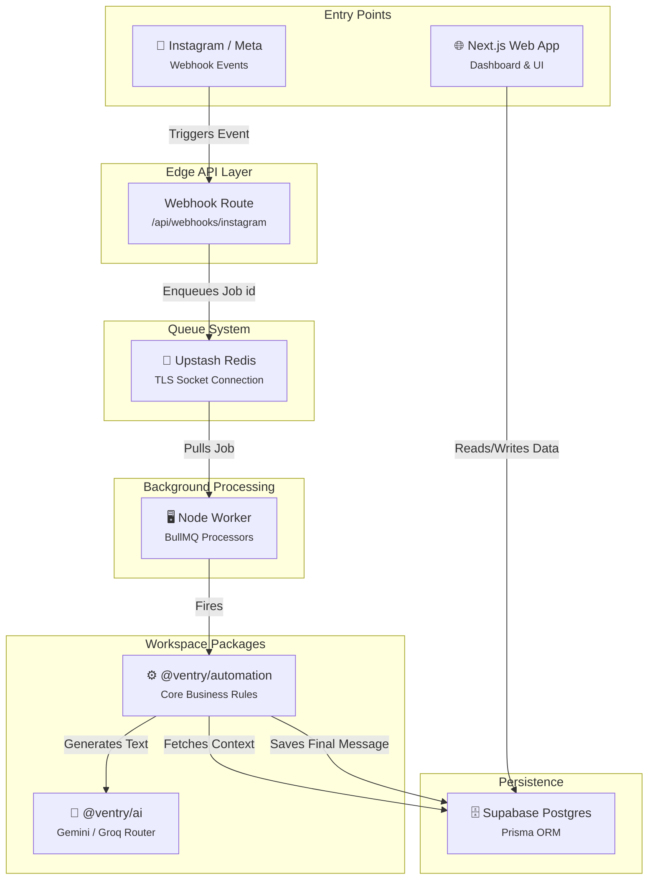
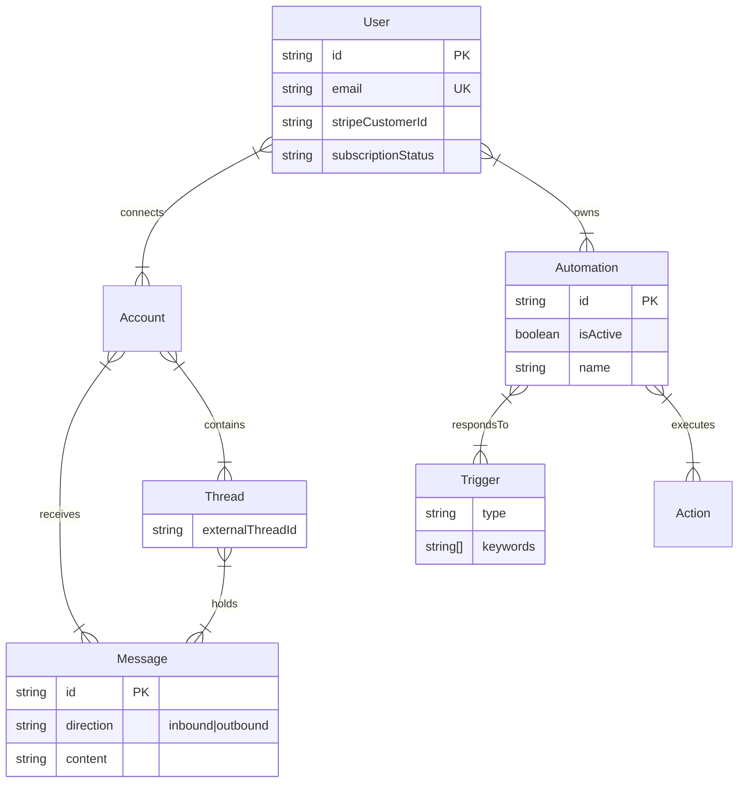

<div align="center">

# 🚀 Ventry

### AI-Powered Social Automation Engine

A high-performance event-driven SaaS monorepo for automating social media interactions, analyzing intents, and generating intelligent replies via dual-pipeline AI integration.

[](#)
[](#)


</div>

---

## 📖 Summary

**Ventry** is a strict, modular monorepo engineered to intelligently schedule social media posts and auto-reply to comments/DMs. Built specifically for performance and modular scalability, it isolates client-facing web routes from background processing using dedicated packages and service layers.

Unlike standard monoliths, Ventry operates on a resilient **Event-Driven Architecture**. Incoming webhooks are immediately queued via Upstash Redis and robustly handled by dedicated BullMQ Node.js workers. The core business logic is heavily centralized inside isolated workspace packages (`@ventry/automation`, `@ventry/ai`), utilizing Google's generative models and Groq's high-speed inference for dynamic, context-aware user replies.

---

## ✨ Features

### ⚙️ Core Engine
| Feature | Description |
|---|---|
| **Event-Driven Handlers** | Idempotent webhook parsing seamlessly enqueued to Redis without blocking the web UI. |
| **Automation Engine** | Centralized trigger matchers processing keywords and assigning actions reliably. |
| **Conversation Memory** | Context builders fetching the last 10 messages of a thread to maintain AI state. |
| **Isolated Workers** | Standalone Node.js processes pulling BullMQ jobs for replies, ingestions, and posting. |

### 🤖 AI Pipeline
| Feature | Description |
|---|---|
| **Intelligent Routing** | Automatically routes logic between latency-sensitive (Groq) or generation-heavy (Gemini) paths. |
| **Multi-Turn Context** | Passes historical interactions seamlessly to ensure natural, friendly, and contextual responses. |
| **Dual Provider Safety** | Independent abstracted SDK clients (`@google/genai` & `groq-sdk`) structured for expansion. |

### 🔐 Platform Capabilities
| Feature | Description |
|---|---|
| **Optimized Monorepo** | Strict PNPM workspaces with Turborepo caching to enforce vertical package boundaries. |
| **Supabase + Prisma** | Best-in-class relational mapping combined with safe Auth layers. |
| **Upstash TLS Connections** | Native configurations routing Redis queues securely over rediss:// TLS channels. |
| **Subscriptions** | Native Stripe integration managing SaaS tiers for AI generation quotas. |

---

## 🏗 Architecture



---

## 🛠 Tech Stack

| Layer | Technology | Purpose |
|---|---|---|
| **Frontend UI** | Next.js 14, React 18 | Dashboard interfaces and route handlers |
| **Styling** | TailwindCSS, Shadcn UI | Semantic utility-class styling with 4px scales |
| **Background Processing**| Node.js, BullMQ | Resilient delayed, retried task orchestration |
| **Caching/Queues** | Upstash Redis | Hosted resilient TCP Redis cache |
| **Database ORM** | Prisma | Strongly typed dataset management |
| **Backend/Auth** | Supabase Postgres | Authentication, Relational schema |
| **AI (Generation)** | Google Gemini 1.5 Flash | High-fidelity post and caption creation |
| **AI (Latent Responses)**| Groq Llama 3 | Blazing fast conversational text auto-replies |
| **Payments** | Stripe | Integrated checkout webhooks and subscriptions |
| **Orchestration** | PNPM + Turborepo | Strict package definitions and build cache |

---

## 📂 Project Structure

```text
Ventry/
│
├── apps/                               
│   ├── web/                            # ─── Next.js Platform ───
│   │   ├── app/api/                    # Webhook and Edge logic
│   │   ├── app/layout.tsx              # Main UI Shell
│   │   └── tailwind.config.ts          
│   └── worker/                         # ─── Node.js Worker ───
│       ├── src/jobs/                   # Specific BullMQ handlers
│       └── src/worker.ts               # Execution entry point
│
├── packages/                           # ─── Shared Workspace ───
│   ├── ai/                             # Provider routing (Gemini/Groq)
│   ├── automation/                     # Core rules (matchers, executors)
│   ├── config/                         # TSConfig, ESLint, Prettier
│   ├── db/                             # Prisma schema and client singletons
│   ├── queue/                          # Redis bindings and Job producers
│   └── ui/                             # Global design system & Shadcn primitives
│
├── turbo.json                          # Turborepo build graph definitions
├── pnpm-workspace.yaml                 # Linked directory rules
└── package.json                        # Root commands
```

---

## 🗄️ Database Schema

### Core Engine



---

## 🚀 Getting Started

### 1. Prerequisites
- Node.js 18+
- PNPM (`npm install -g pnpm`)
- Live Supabase Project & Upstash Redis instance
- Meta / Stripe Developer Keys

### 2. Setup
Clone the repository and configure your credentials across the `.env` at the project root.
*(A skeleton `.env` or `.env.example` handles keys for Prisma, Supabase, Rediss, Stripe, and AI providers.)*

### 3. Initialize Database
Execute Prisma migrations strictly from the database package workspace to seed your relational layout into Supabase.

```bash
cd packages/db
npx prisma db push
npx prisma generate
```

### 4. Build & Run Environment

Utilize the root Turborepo commands to orchestrate simultaneous pipelines:

```bash
# 1. Install workspace dependencies
pnpm install

# 2. Run both the Web UI and Background Node Workers
pnpm dev
```

---

## 📝 License

[](./LICENSE)

This project is licensed under the **MIT License** — rigidly designed for open extensibility.
